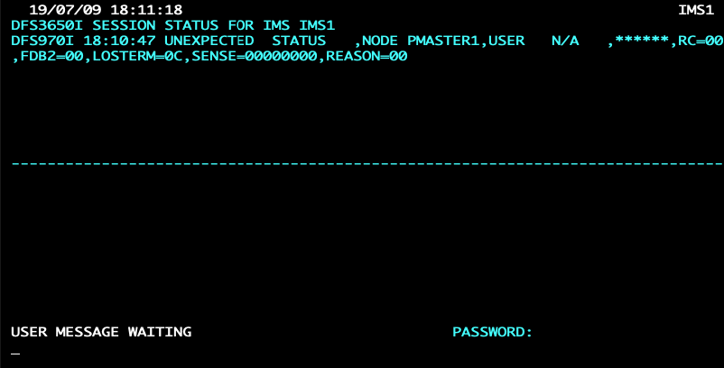
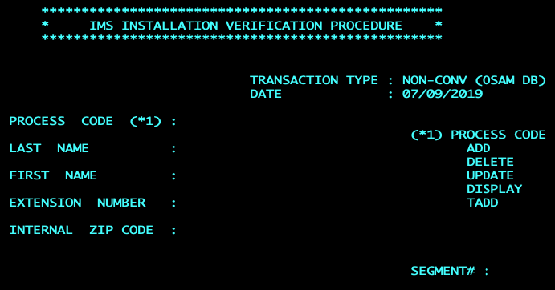
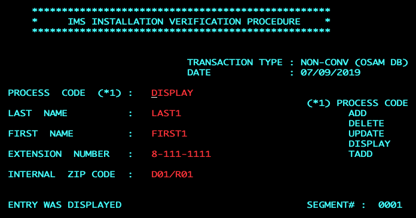
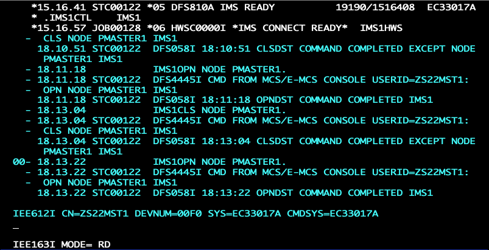
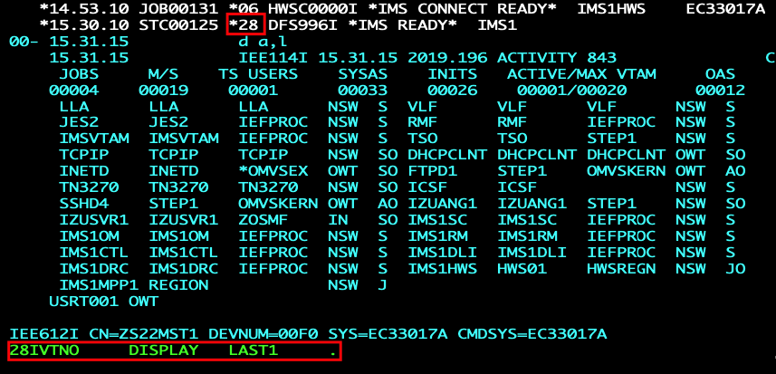
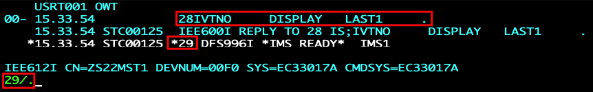
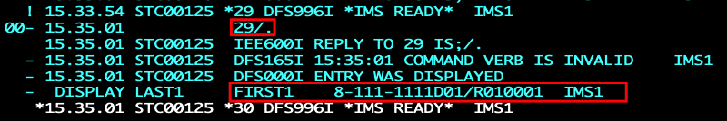

# IMS DB/TM workflows for z/OSMF

## Overview

You can rapidly provision or deprovision an IMS™ DB/TM system by using the IBM® z/OS® Management Facility (z/OSMF) with these z/OSMF workflow samples.

#### Provision workflow
The provision workflow will provision an IMS™ DB/TM subsystem with these steps:

| Step          | Description   | JCL  	  |
| :------------:|:------------- |:------- |
| 1 | Set the Workflow Variable| |
| 2 | Assign Dynamic Provisioning Variables| |
| 3 | Specify IMS criteria| |
| 4 | IMS installation preparation| |
| 4.1 | Allocate work data set for zCloud IMS| DFSALWRK.jcl|
| 4.2 | Allocate IMS system definitions data sets| DFSALSY2.jcl|
| 4.3 | IMS system definition preprocessor utility| DFSGNPRE.jcl|
| 4.4 | Run SYSDEF stage 1| DFS4STG1.jcl|
| 4.5 | Run SYSDEF stage 2| DFS4STG2.jcl|
| 4.6 | Build the zCloud IMS| |
| 4.6.1 | RACF security exits for IMS| DFSC105J.jcl|
| 4.6.2 | Authorize IMS data sets to z/OS| DFSSETPG.jcl|
| 4.6.3 | Allocate IMS data sets| DFSALSY1.jcl|
| 4.6.4 | Dynamic allocation of IMS system data sets| DFSDYNAL.jcl|
| 4.6.5 | Create IMS catalog database| DFSALCAT.jcl|
| 4.6.6 | Prepare IMS DB recovery control| DFSE314J.jcl|
| 4.6.7 | Allocating TCPIP port| |
| 4.6.8 | Allocating SSL TCPIP port| |
| 4.6.9 | Ready the IMS proclib| DFSE302J.jcl|
| 4.6.10 | Define IMS subcomponents| DFSE303J.jcl|
| 4.6.11 | Define IMS subcomponent CQS| DFSE304J.jcl|
| 4.6.12 | Create IMS connect| DFS4ICON.jcl|
| 4.6.13 | IMS configuration defaults| DFSE305J.jcl|
| 4.6.14 | Define IMS components to z/OS| DFS4CPYP.jcl|
| 4.6.15 | Create IEFJOBS Members| IEFJOBS.rexx|
| 4.7 | Define IMS resources to z/OS| DFSE313J.jcl|
| 4.8 | Copy staging libraries| DFSCPYST.jcl|
| 4.9 | Prepare exits for security and connectivity| DFSE315J.jcl|
| 4.10 | Prepare ACBLIB for sample applications| |
| 4.10.1 | Database generation| DFSAPPGN.jcl|
| 4.10.2 | Program specifications generation| DFS4APPG.jcl|
| 4.10.3 | Access control definitions generation|
| 4.11 | Enable IMS local online change| DFSENOLC.jcl|
| 4.12 | Establish IMS active libraries| DFS4ACTV.jcl|
| 4.13 | Specify DB recovery control defaults| DFSDFDRC.jcl|
| 4.14 | Load IMS catalog database| DFSLDCAT.jcl|
| 4.15 | Allocate Database Dataset for transaction IVTNO | DFSALIVT.jcl |
| 4.16 | Load contacts list database for transaction IVTNO | DFSLDIVT.jcl |
| 4.17 | Load MFS (Message Format Service) Libraries | DFSLDMFS.jcl |
| 4.18 | Compile and link IMS IVP Application | DFSCLIVT.jcl |
| 4.19 | Register contacts list database with RECON dataset | DFSRCIVT.jcl |
| 5 | Start IMS concomitant address spaces| |
| 5.1 | Start SCI| |
| 5.2 | Start OM| |
| 5.3 | Start RM| |
| 6 | Start the IMS control region| |
| 6.1 | Start the IMS control region address space| |
| 7 | Perform IMS restart| |
| 7.1 | Wait for IMS to be ready for cold start| WaitJob.rexx|
| 7.2 | Cold start IMS| |
| 8 | Start IMS connect| |
| 9 | Start the IMS MPP (Message Processing Program) Region | DFSSTREG.jcl |


#### De-provision workflow
The de-provision workflow will de-provision an IMS™ DB/TM subsystem with these steps:

| Step          | Description   | JCL  	  |
| :------------:|:------------- |:------- |
| 1 | Set the Workflow Variable| |
| 2 | Assign Dynamic Provisioning Variables| |
| 3 | Specify IMS criteria| |
| 4 | Wait for IMS Ready| |
| 5 | Perform IMS shutdown| |
| 5.1 | Stop all IMS resources| DFSSTPRS.jcl|
| 5.2 | Immediate IMS shutdown| DFSISHUT.jcl|
| 6 | Stop IMS concomitant address spaces| |
| 6.1 | Stop IMS connect| DFSSTPIC.jcl|
| 6.2 | Stop OM| DFSSTPOM.jcl|
| 6.3 | Stop RM| DFSSTPRM.jcl|
| 6.4 | Stop CSL| DFSSTPAS.jcl|
| 7 | Unmount ZFS files| DFSUNMNT.jcl|
| 8 | Delete IMS system libraries| |
| 8.1 | Delete IMS system definition data sets| DFSSYSDL.jcl|
| 9 | Destroy the zCloud IMS environment| |
| 9.1 | Delete IMS data sets| DFSDELLB.jcl|
| 9.2 | Delete IMS catalog database| DFSDCTLG.jcl|
| 9.3 | Delete IVP Datasets | DFSDIVPD.jcl|
| 10 | Delete z/OS components| |
| 10.1 | Unauthorize data sets to z/OS| DFSDLAPF.jcl|
| 10.2 | Delete IMS services from z/OS| |
| 10.3 | Delete IEFJOBS Members| |
| 10.4 | Delete IMS components from z/OS| DFSDLMBR.jcl|
| 11 | Returning IMSConnectports| |
| 11.1 | Returning IMSConnect port| |
| 11.2 | Returning IMSSSLConnect port| |


#### Input variables
The workflow_variables.properties file contains the properties that are shown in the
following table.
The properties file contains default values for some of these variables, but you must customize
others.

| Property      | Remarks       |
| :-------------|:------------- |
| DFS_IMSPlex | IMS Plex name|
| DFS_IMSXCFGroup | IMS coupling facility group|
| DFS_IMS_CRC | Command recognition character|
| DFS_IMS_LINEGRP | DC terminal unit type|
| IST_VTAM_IMSAPPLID | IMS APPLID|
| DFS_AUTH_LIB_HLQ| HLQ for IMS installation libraries|
| DFS_AUTH_LIB_HLQ1| 1st High level HLQ for target for IMS instance data sets|
| DFS_AUTH_LIB_HLQ2 | 2nd level HLQ for IMS instance data sets to read or write|
| DFS_AUTH_LIB_SYSHLQ2 | 2nd level HLQ for IMS system data sets to read from|
| DFS_SMS_ENVIRONMENT | True or false value for SMS environment|
| DFS_SMS_CLASS | SMS storage class|
| DFS_SMS_MCLASS | SMS management class|
| DFS_DS_VOLUME1 | Data set volume|
| DFS_DS_VOLUME2 | Data set volume|
| DFS_IMS_UNIT | Data set device type|
| DFS_IMS_UNIT2 | Data set device type|
| zCloud_LERuntime | Language environment runtime data set|
| zCloud_MACLIB | z/OS macros library|
| zCloud_LPALIB | z/OS LPA library|
| zCloud_PROCLIB IMS | IMS PROC library|
| zCloud_MODGEN | z/OS MODGEN library|
| zCloud_CSSLIB | z/OS PROC library|
| IST_VTAM_Procedure | VTAM procedure|
| DFS_VTAM_NODE_IMSMTO | VTAM node for IMS MTO|
| DFS_VTAM_NODE_IMSND1 | VTAM node for IMS terminal 1|
| DFS_VTAM_NODE_IMSND2 | VTAM node for IMS terminal 2|
| DXR_IRLM_SSID | IRLM subsystem name|
| DXR_IRLM_Procedure | IRLM proc|
| EZB_TCPIP_LoadLib | TCP/IP load library|
| DFS_IXUSTIM1 | EXEC time parameter for SMP/E, SYSDEF STAGE1|
| DFS_IXUSTIM3 | EXEC time parameter for MPPs, IFPs, IRLM, VTAM|
| GIM_IMS_GLOBALzone_CSI | IMS SMP/E target zone ID|
| GIM_IMS_TARGETzone | IMS SMP/E global zone CSI|
| DFS_MOUNTPOINT | Mount point for unix files|
| DFS_FSTYPE | File system for unix files|
| DFS_IMS_SECURITY | True or false value to use SMS-managed DASD for IMS libraries|
| DFS_useIEFJOBS = N |Use IEFJOBS dataset or not|
| zCloud_IEFJOBS z/OS data set that contains job source JCL for started tasks|
| zCloud_approver | Approver for Cloud|
| zCloud_admin | Admin userid for Cloud provisioning|
| zCloud_IMS_SVC_Type2 | SVC Values|
| zCloud_IMS_SVC_Type4 | SVC Values|


## Pre-requisites
* An SMP/E installation of IMS is done and the IMS load libraries are available.
* Identify the z/OS and IMS system parameters.
* IMS SVCs are installed on the system.
* The workflow files are installed in a suitable USS directory.
* z/OSMF must be started. Both the angel and server z/OSMF address spaces must be started.

## Security requirements
To run the workflow, you need the following authority:
* RACF READ authority on SMP/E-installed IMS libraries.
* RACF UPDATE authority on the high-level qualifiers (HLQs) you are using for the IMS instance libraries.
* Authority to ADD or DELETE APF authorizations.

## Package structure
The repository includes the following files:
* ims.mf
  * This manifest file can be used to create and new Cloud Provisioning and Management Software Services template.
* provision.xml
  * This workflow XML provisions an IMS Fast Path DEDB database. Do not modify this file.
* deprovision.xml
  * This workflow XML de-provisions an IMS Fast Path DEDB database. Do not modify this file.
* StartIMS.xml
  * This workflow XML starts the IMS control region and IMS resources.
* StopIMS.xml
  * This workflow XML stops the IMS control region and IMS resources.
* IMSVariables.xml
  * This file defines the variables referenced by the steps in the workflow.
* workflow_variables.properties
  * This properties file contains values for the variables referenced in the provision_IMS_DEDB.xml and deprovision_IMS_DEDB.xml workflows. Edit the workflow_variables.properties file to specify your system specific information for the variables in the file.

## Installation
* Use FTP to transfer the provision.xml, deprovision.xml, and the workflow_variables.properties files to USS on the z/OS host in binary mode.
* Make these files visible to the z/OSMF application. Do this by changing the access permissions of the files using the chmod command.
  * Example chmod commands:
    ```Java
    chmod 755 provision.xml
    ```
  * Or if the file is in a folder with the name of workflows:
    ```Java
    chmod -R 755 workflows
    ```

## Steps to run the workflow using the z/OSMF web interface
1. Log into the IBM z/OS Management Facility web interface.
1. Select **Workflows** from the left menu.
1. Select the **Actions** drop down menu.
1. Select **Create Workflow**.
1. In the Create Workflow dialog, specify the following information:
    *	Workflow definition file
    *	Workflow variable input file
    *	System
1. Select **Next**.
1. Select **Assign all steps to owner user ID** if you are going to run all of the workflow steps with the current user ID.
1. Select **Finish**.
1. Right-click the first action and select **Perform**.

For more information about running a workflow see [Creating a workflow](https://www.ibm.com/support/knowledgecenter/en/SSLTBW_2.3.0/com.ibm.zosmfworkflows.help.doc/izuWFhpCreateWorkflowDialog.html) in the IBM Knowledge Center.

## Contacts Database Sample Application
Upon successful provisioning of the workflow using z/OSMF, a sample contacts database application will be running in an MPP region that has been initialized with a VTAM terminal through the use of the `/OPNDST` command. The application transaction code is **IVTNO** that will query a IMS database and respond according to the request parameters. You can query the database to retrieve contact information such as first name, last name, telephone extension, and zip code. 

The application supports process code operations that include **ADD**, **DELETE**, **UPDATE**, **DISPLAY** and **TADD**. These process codes can be used with a request to operate on **LAST NAME**, **FIRST NAME**, **EXTENSION NUMBER** and **ZIP CODE**.

## Steps Connecting to Sample Application
Successful connectivity to the sample application requires that you establish a **VTAM** session **before** running the workflow that provisions IMS with z/OSMF. Ensure you have an **active** and **connected** **x3270** session with **VTAM**. 

Connecting to a VTAM session can be configuration specific beyond the defaults, so only a general guide will be demonstrated.

1. Use the LOGON command to connect to a VTAM terminal session.
    * [LOGON command documentation](https://www.ibm.com/support/knowledgecenter/en/SSLTBW_2.3.0/com.ibm.zos.v2r3.istrdr0/rlogonsyn.htm)
    * The **APPLID** will correspond to the value entered for **IST_VTAM_IMSAPPLID** in the [workflow variable properties file](workflows/ims/workflow_variables.properties)
1. Initially the terminal session will be blank and will appear to remain inactive until the provisioning has completed.
    * When the sample application has connected with a VTAM terminal the session will look similar to the screen capture below.
      
1. To display an interactive panel for the sample application, use the MFS service to the process the request and send a reply back to the terminal.
    * Enter the command `/FOR IVTNO` to access the MFS panel for the sample application.
      
      
1. In the MFS panel enter the values:
    * PROCESS CODE: DISPLAY
    * LAST NAME: LAST1  
      
    * Press Enter to see the results below.
      
## Steps Running the Sample Application
Optionally, the sample application can be run in the IMS console using the applications transaction code IVTNO.
1. Sign onto an IMS user terminal session.
    * Below is a screen capture of a IMS terminal session
      
    * Using the ims reply number which can be found alongside the IMS READY message, use the command syntax:
      `<IMS REPLY NUMBER><Transaction Code><5 spaces><Process code><3 spaces><Last Name><5 spaces><period>`
    * In the following screen capture, the reply number is 28 and the command run is: `28IVTNO     DISPLAY   LAST1     .`
      
    * The IMS console will display a new reply number 29 and the command it ran. 
      * To obtain the result, run the command `29/.` which follows syntasx `<IMS REPLY NUMBER></.>`
        
    * The result **FIRST1    8-111-1111D01/R010001  IMS1** will be shown in the IMS terminal session. 
      

## Troubleshooting
* IZUWF0105E   Workflow property file file-name is either not found or cannot be accessed
  * Typically, this error occurs when the file does not exist at the given path. If the file does exist, access permission to the file must be set by using the chmod command.
* If there is no **Workflows** menu option in the z/OSMF web interface configure the IZUPRMxx member in SYS.PARMLIB to specify the WORKLOAD_MGMT in the PLUGINS statement. For more information see [creating a IZUPRMxx](https://www.ibm.com/support/knowledgecenter/en/SSLTBW_2.2.0/com.ibm.zos.v2r2.izua300/izuconfig_IZUPRMxx.htm) in the IBM Knowledge Center.
  * Example:

        PLUGINS(INCIDENT_LOG  
        COMMSERVER_CFG
        CAPACITY_PROV
        SOFTWARE_MGMT
        ISPF          
        RESOURCE_MON  
        WORKLOAD_MGMT)

## z/OSMF documentation

Visit the IBM Knowledge Center for more information on [IBM z/OS Management Facility](https://www.ibm.com/support/knowledgecenter/search/IBM%20z%2FOS%20Management%20Facility?scope=SSLTBW_2.2.0).


End
